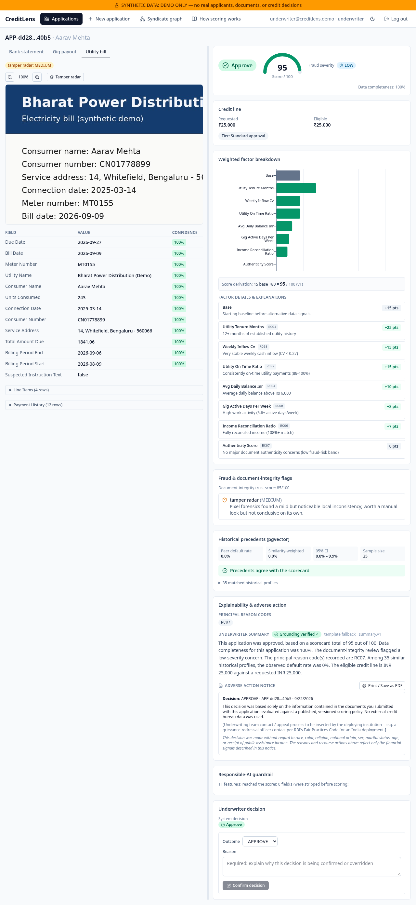
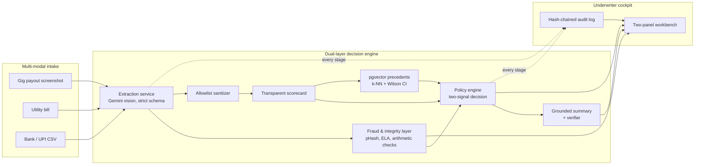
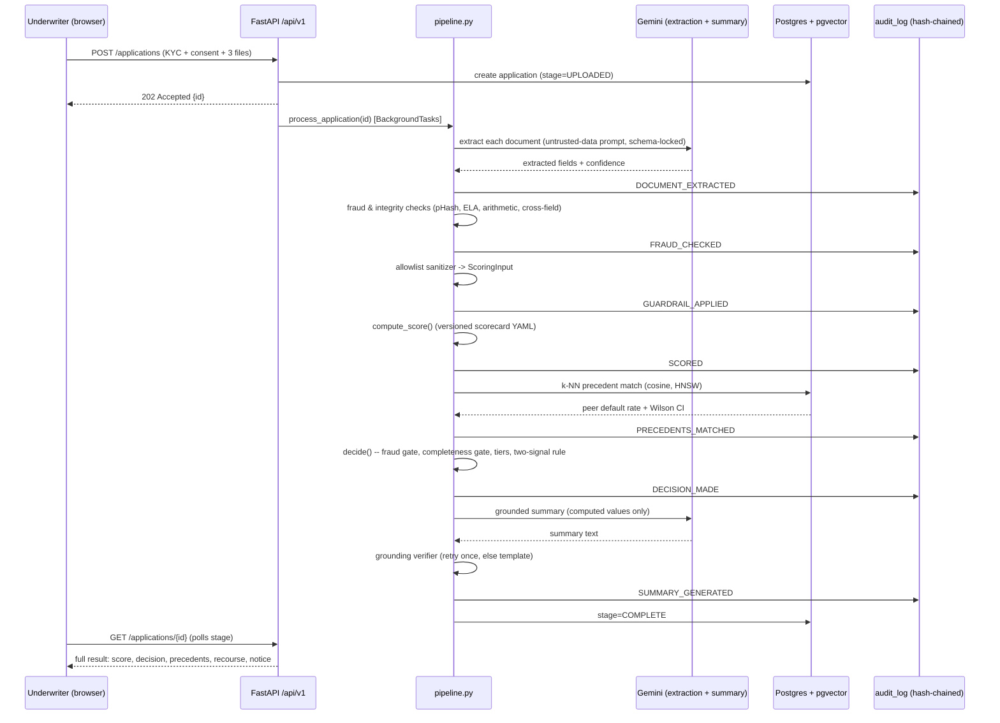
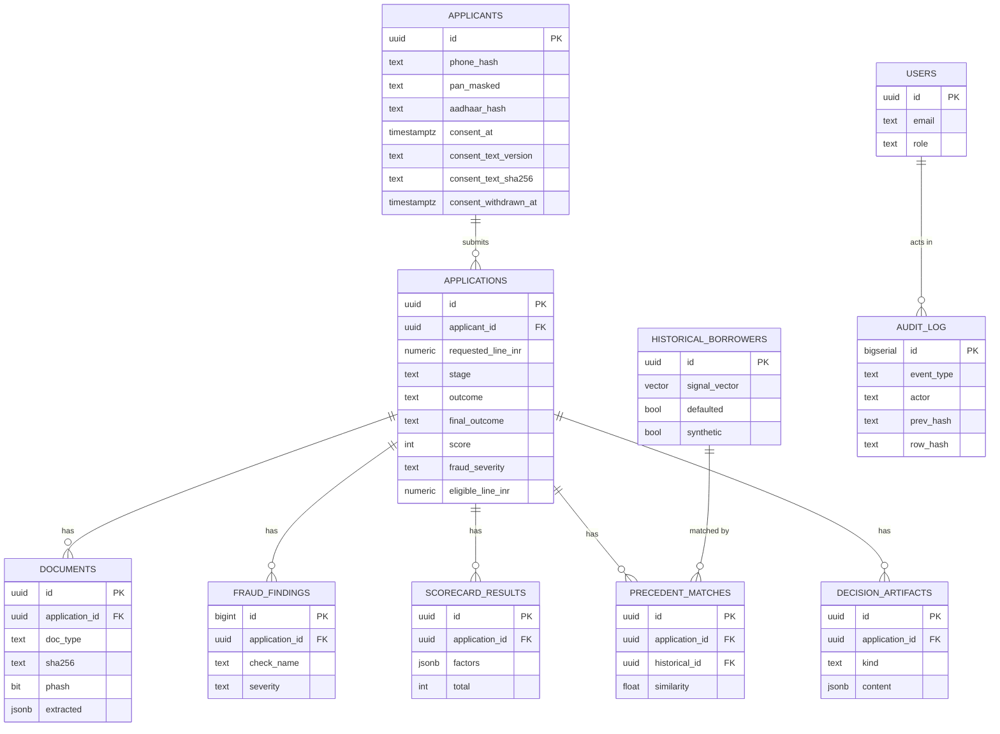
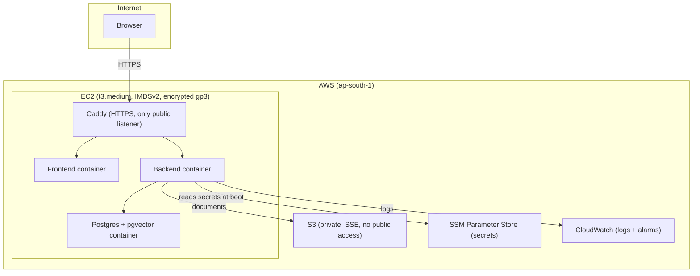

# CreditLens

**A real-time, multi-modal underwriting engine for thin-file / new-to-credit (NTC) gig workers in
India.** Applicants upload three alternative-data documents (a gig-platform payout screenshot, a
utility bill, and a bank/UPI statement); CreditLens extracts and cross-checks the signals, screens
for document fraud and syndicate reuse, computes a fully transparent additive scorecard, compares
the applicant against nearest historical precedents, and returns **Approve / Refer for Review
(tiered limit) / Decline** — with itemised reasons, a plain-English grounded summary, counterfactual
recourse, an adverse-action notice, and a tamper-evident audit log an underwriter can independently
verify. Two-panel React cockpit; no black-box model anywhere in the decision path.

> **All data in this repository and every screenshot below is SYNTHETIC.** No real applicant,
> document, or bureau data was used anywhere in this project's construction, tuning, or evaluation.
> See [`docs/data_card.md`](docs/data_card.md).



## Why this exists

Traditional credit bureau data is thin or absent for gig workers who are paid daily/weekly across
platforms and don't hold conventional salaried employment records. CreditLens' premise —
demonstrated with a synthetic population in `docs/fairness_report.md` — is that a **bureau-only**
underwriting model has literally no signal for this population and must decline everyone; an
alternative-data scorecard, built with the same rigor and auditability a bureau-based model would
need, can respond with **Approve or a reviewable Refer** instead.

## Table of contents

- [Architecture](#architecture)
- [Quick start](#quick-start)
- [Demo walkthrough](#demo-walkthrough)
- [Tech stack](#tech-stack)
- [API](#api)
- [Testing](#testing)
- [Security and responsible AI](#security-and-responsible-ai)
- [Data handling](#data-handling)
- [Reports and real numbers](#reports-and-real-numbers)
- [Limitations](#limitations)
- [Production path](#production-path)
- [Repository map](#repository-map)

## Architecture



**The LLM never scores or decides.** Gemini is used for exactly two things, per strict architectural constraints:
(a) extracting document fields into a strict, validated Pydantic schema, and
(b) narrating an already-computed decision in plain English, with every number in that narration
checked against the computed values that produced it (`app/services/explain/grounding.py`) before
it is trusted — an ungrounded attempt is silently replaced by a deterministic template.

### Pipeline sequence



### Data model (ER diagram)



### AWS deployment

This exact architecture was provisioned with Terraform (`deploy/terraform/`) and verified live on
a single EC2 instance in `ap-south-1` — HTTPS via Caddy/Let's Encrypt, login as all three roles,
the P05→P06 collision demo with real Gemini extraction, documents landing in the private S3
bucket, CloudWatch logs, and a fully valid audit chain, all confirmed end-to-end against the
running deployment.



## Quick start

Requires Docker with the Compose plugin, a [Google Gemini API key](https://aistudio.google.com/apikey), and
Python 3.12 + [uv](https://docs.astral.sh/uv/) on your host (only for the one-time synthetic-data
generation step below -- the app itself runs entirely in containers).

```bash
git clone <this-repo-url> creditlens && cd creditlens
cp .env.example .env
# edit .env: set GEMINI_API_KEY, and generate real values for JWT_SECRET / HMAC_PEPPER
#   (32+ random characters each -- e.g. `openssl rand -base64 48`)
make demo
```

`make demo` builds and starts the full stack, waits for health, seeds demo users + the synthetic
history dataset, and prints the URLs and demo credentials. Then:

1. Open **http://localhost:8080**, log in as `underwriter@creditlens.demo` (password printed by
   `make demo` / in your local `.env`'s `DEMO_UNDERWRITER_PASSWORD`).
2. From the Applications queue, use **Load demo persona** to submit **P05**, then **P06** — watch
   the workbench raise a real, corroborated document-collision alert (P06 reuses P05's utility bill
   under a different identity).
3. Open the **audit log** and click **Verify chain** to see the hash-chain proof that nothing in the
   audit trail has been altered.

If you don't yet have a Gemini key, set `MOCK_LLM=true` in `.env` first — the whole pipeline runs
deterministically against each synthetic document's own ground-truth sidecar, at zero cost, and
every demo persona still produces its designed outcome (see the persona table below).

## Demo walkthrough

| Persona | What it demonstrates | Outcome |
|---|---|---|
| P01 | Strong, stable, complete applicant | **APPROVE** |
| P02 | Moderate volatility, 7-month utility tenure | **REFER** (tiered limit) |
| P03 | High volatility, low balance, 2-month tenure, late payments | **DECLINE**, with a real, re-verified counterfactual recourse path |
| P04 | Tampered gig-payout screenshot | Document-integrity flags surface in the workbench |
| P05 → P06 | P06 resubmits P05's utility bill (resized/re-encoded) under a different identity | **pHash collision alert**, corroborated by matching identifiers, syndicate graph edge |
| P07 | Bill/bank holder name and payout-account last-4 both disagree with KYC | **REFER**, identity-mismatch reason code (RC08), never auto-declined for this alone |
| P08 | Only the bank statement was submitted (thin file) | **REFER**, incomplete-application reason code (RC09), never DECLINE for missing data |
| P09 | Adversarial prompt-injection attack in document text | **REFER**, document integrity concern (RC07), prompt-injection defended |
| P10 | Blind-spot borrower: high scorecard (85) but volatile cashflow / low balance days | **REFER**, `TWO_SIGNAL_DOWNGRADE` (precedent peer default rate CI lower bound > 0.15) |
| P11 | Resilient borrower: low scorecard (29) but durable gig tenure and stable earnings | **REFER**, `TWO_SIGNAL_UPGRADE` (precedent peer default rate CI upper bound < 0.19) |

Full persona-by-persona verified results (score, fraud severity, reason codes) were confirmed
end-to-end via the integration test suite (`backend/tests/integration/test_pipeline_full.py`).

## Tech stack

| Layer | Choice |
|---|---|
| Frontend | React 19 + Vite + TypeScript, Tailwind CSS v4, Lucide icons, Recharts, TanStack Query, React Router; API types generated from the live OpenAPI schema (`openapi-typescript`) |
| Backend | Python 3.12, FastAPI (async), Pydantic v2, SQLAlchemy 2 (async) + asyncpg, Alembic, structlog, slowapi, argon2-cffi, PyJWT, Pillow, imagehash, PyMuPDF, rapidfuzz, `google-genai`, boto3, tenacity |
| Database | PostgreSQL 16 + pgvector (HNSW cosine index for precedent matching) |
| AI | Google Gemini (vision extraction with structured JSON-schema output; zero/lowest-temperature grounded summary) behind an `LLMClient` protocol — the extraction/summary provider is swappable without touching any caller |
| Infra | Docker Compose locally; Terraform-provisioned AWS EC2 + S3 + SSM + CloudWatch for deployment (`deploy/`) |

## API

Full interactive docs at `GET /docs` (Swagger UI) once the backend is running; the raw OpenAPI
schema is also committed at `docs/openapi.json`. Everything is under `/api/v1`, JWT-authenticated,
role-scoped (`underwriter` / `auditor` / `admin`).

Key endpoints: `POST /applications` (multipart KYC + consent + documents) · `GET /applications` /
`GET /applications/{id}` · `GET /applications/{id}/documents/{doc_id}/file` and `/overlay` ·
`POST /applications/{id}/override` · `GET /applications/{id}/notice` · `GET /fraud/graph` ·
`GET /audit` and `GET /audit/verify` · `GET /meta/scorecard` · `GET/POST /demo/personas*` (only
when `ENABLE_DEMO_ENDPOINTS=true`).

## Testing

```bash
make test    # backend (pytest + hypothesis), frontend (vitest + RTL), datagen (pytest)
make lint    # ruff, eslint + tsc, ruff
```

At time of writing: **348 backend tests** (unit + integration, including hypothesis property tests
for score-monotonicity and sanitizer PII-invariance across 200 random profiles each), **16 frontend
tests**, **31 datagen tests** — all passing (**395 tests total**). Backend coverage on the decision-critical packages
(`scoring`, `fraud`, `guardrails`, `explain`) is **≥80%** on every module.

The frontend is additionally driven end-to-end with **Playwright** against the real running stack
(login, submit personas, verify the collision alert, verify the audit chain) — see
`frontend/e2e/cockpit.spec.ts` and the real screenshots in `docs/screenshots/`.

## Security and responsible AI

- **No black-box decisioning** — the scorecard is a versioned, additive YAML config; an LLM never
  scores, decides, or overrides anything.
- **Allowlist sanitizer** (not a denylist) — protected attributes and PII are structurally incapable
  of reaching the scorer, proven with property-based tests and an explicit proxy-feature regression
  test (`docs/fairness_report.md` §3).
- **Hash-chained, append-only audit log** — a Postgres trigger blocks `UPDATE`/`DELETE`/`TRUNCATE`
  on `audit_log` for every role including the DB admin; `GET /audit/verify` re-walks the chain.
- **Prompt-injection defense** — uploaded documents are treated as untrusted pixel data; multi-layer
  defense (regex scanning, schema validation, vision instruction flags) caps outcome at REFER (RC07).
  Empirically proven on 6 adversarial documents with 0 scorecard factor distortion (`docs/injection_eval.md`).
- **Two-signal underwriting** — couples the transparent scorecard with 10-dimensional pgvector precedent
  matching, reducing approved portfolio default rate from 14.3% to 7.8% (-45.3% relative risk reduction)
  on held-out data (`docs/two_signal_eval.md`).
- **Responsible data handling** — Aadhaar is never stored (HMAC-SHA256 + pepper only), PAN/phone are
  masked on every API response, PII is redacted from structured logs (regex + key-name matching),
  consent is captured and versioned at intake.
- Full **STRIDE-lite threat model**, real security-scan results (`pip-audit`, `npm audit`, `bandit`,
  `gitleaks`), and every accepted-risk decision: [`docs/threat_model.md`](docs/threat_model.md).

## Data handling, consent, and retention

- **Server-side consent enforcement:** Plain-English, purpose-limited consent is versioned in `backend/app/config/consent_v1.md` and served via public `GET /api/v1/meta/consent` (returning text, version, and SHA-256). Both `POST /api/v1/applications` and demo persona submissions enforce consent server-side (HTTP 422 if unaccepted or version is stale). The frontend fetches and displays this dynamically without hardcoded copy.
- **Zero-PII audit record:** The immutable, hash-chained `APPLICATION_SUBMITTED` event records `consent_at`, `consent_text_version`, and `consent_text_sha256` with zero applicant PII in the payload.
- **Consent withdrawal & retention purge:**
  - Applicants can withdraw consent via `POST /api/v1/applications/{id}/withdraw-consent`, setting `consent_withdrawn_at` and recording a `CONSENT_WITHDRAWN` audit event.
  - An admin-only purge endpoint (`POST /api/v1/admin/retention/purge`, supporting `dry_run: bool = True`) deletes physical documents/overlays from storage, redacts applicant PII (`name = "[REDACTED]"`, hashes cleared) and extracted fields, and logs a `RETENTION_PURGE` event.
  - Anonymized decision records and the cryptographic audit hash chain remain 100% valid after purge (`verify_chain` invariant).
- **Aadhaar and PAN protection:** Aadhaar numbers are never stored — only an HMAC-SHA256 (with a server-side pepper) for deduplication. PAN and phone are masked in every API response and log line. Retention is configurable (`RETENTION_DAYS=90`).
This design aligns with the *purpose limitation*, *data minimisation*, and *right to erasure* principles of India's Digital Personal Data Protection (DPDP) Act — stated here as an engineering architecture, **not a claim of legal compliance**, which requires real institutional legal review.

## Reports and real numbers

Every figure below is produced by a script, not typed by hand — regenerate them all with
`make report` (the extraction eval needs a manual, cost-gated run — see the command it prints).

| Report | Source script | What it shows |
|---|---|---|
| [`docs/claims_traceability.md`](docs/claims_traceability.md) | `scripts/generate_claims_traceability.py` | End-to-end evidence mapping: 10 core architectural claims verified against code, tests, and reports |
| [`docs/injection_eval.md`](docs/injection_eval.md) | `scripts/eval_injection.py` | Prompt-injection defense: 6/6 adversarial documents detected, 0 factor distortion, 100% REFER cap |
| [`docs/two_signal_eval.md`](docs/two_signal_eval.md) | `scripts/eval_two_signal.py` | Two-signal evaluation: scorecard + pgvector precedent agreement, blind-spot catch (68.8%), resilient recovery (82.8%) |
| [`docs/fairness_report.md`](docs/fairness_report.md) | `scripts/fairness_audit.py` | Four-fifths adverse-impact check (AIR=0.884 PASS), access uplift (+53.6%), proxy resilience test |
| [`docs/fraud_eval.md`](docs/fraud_eval.md) | `scripts/eval_fraud.py` | pHash threshold selection + FP/FN rates, tamper-radar precision/recall per tamper type, honestly-reported misses |
| [`docs/extraction_eval.md`](docs/extraction_eval.md) | `scripts/eval_extraction.py` | Real-Gemini field-level extraction accuracy + confidence calibration |
| [`docs/validation_report.md`](docs/validation_report.md) | `scripts/validate_scorecard.py` | TEST-split tier distribution, AUC/Gini/KS, two-signal agreement, weight-sensitivity |
| [`docs/data_card.md`](docs/data_card.md) | `datagen/synthgen` (Phase 2) | Synthetic history dataset generation + real summary statistics |
| [`docs/model_card.md`](docs/model_card.md) | — | Intended use, factors/weights, fairness safeguards, limitations |

## Limitations

Stated plainly and in full in [`docs/limitations.md`](docs/limitations.md): synthetic data
throughout; measured (not assumed) fraud-detection blind spots; a single-node deployment; no real
bureau integration; document language coverage limited to the synthetic corpus's English-language
templates.

## Production path

A real deployment would replace document uploads with **consent-based data pipes** (Account
Aggregator for bank data, direct payroll/gig-platform APIs for income — in the spirit of
TartanHQ's model, see `claude_code_prompt_pack.md`'s references) rather than user-supplied
screenshots/CSVs; move `BackgroundTasks` to a durable queue/worker (SQS + a worker fleet); move
Postgres to RDS with automated backups and read replicas; and stand up the monitoring plan described
in `docs/model_card.md` (PSI drift detection, periodic adverse-impact re-testing, scorecard
recalibration against real observed outcomes).

## Repository map

```
backend/app/{main.py, core/, api/v1/, db/, schemas/, prompts/, config/,
             services/{ingestion,extraction,fraud,guardrails,scoring,vectors,explain,audit},
             pipeline.py}
backend/tests/{unit,integration}
datagen/synthgen/        # synthetic document/history/persona generation (Phase 2)
data/demo_pack/          # 11 committed demo personas (P01-P11)
frontend/src/{api,auth,components,features}
deploy/{terraform,scripts}
docs/                    # every report, the threat model, model card, deployment runbook
scripts/                 # eval/validation/fairness/calibration scripts, all wired to `make report`
```

