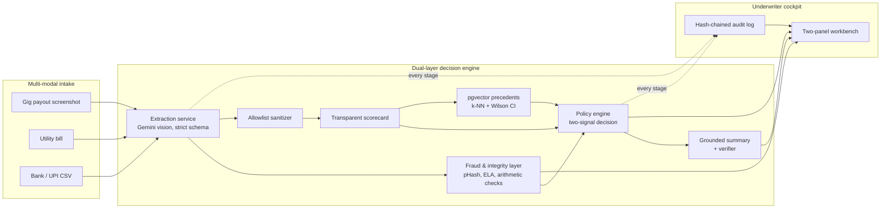
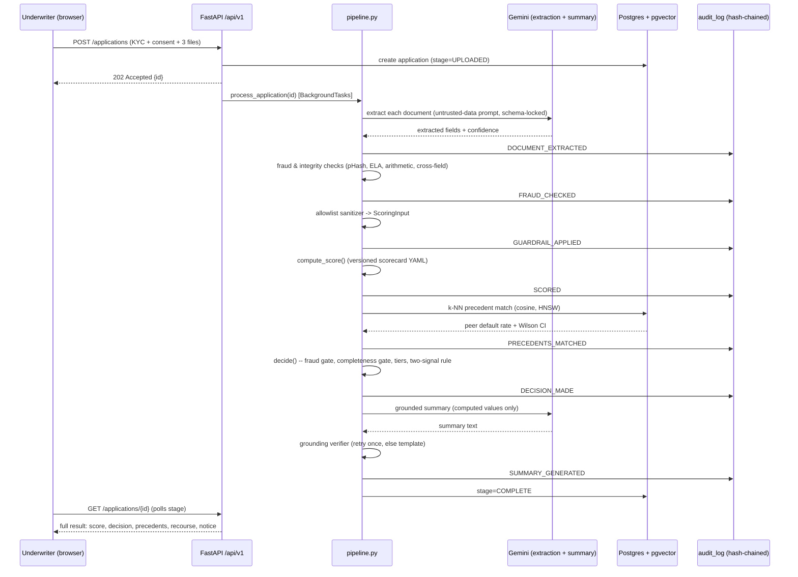
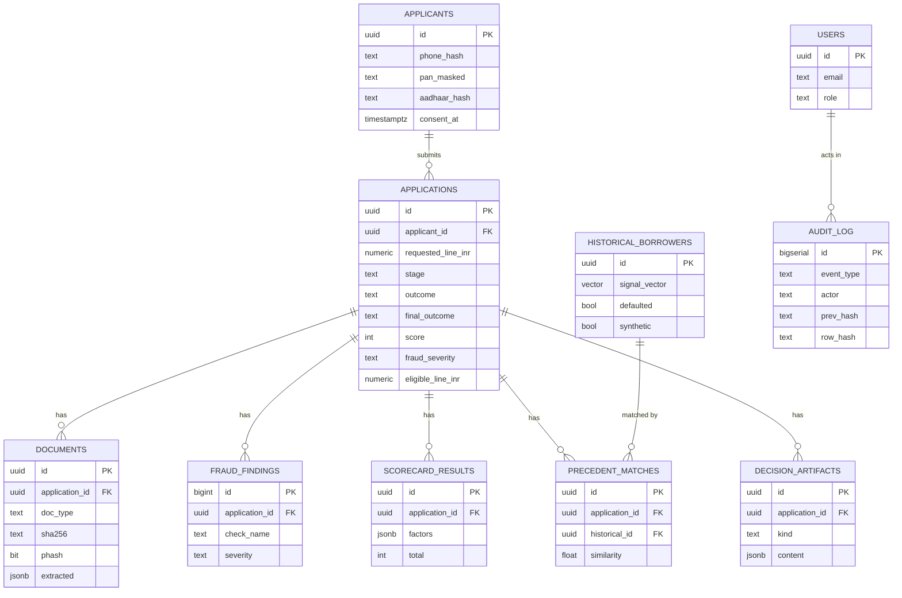
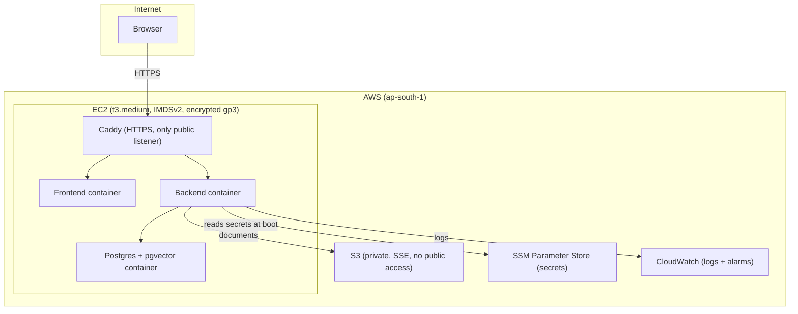

# Architecture

The Mermaid source for every diagram in the README, kept here as the canonical copy so it can be
exported to static images (`docs/diagrams/`) without editing the README's prose around it. See
[`README.md`](../README.md) for the same diagrams in context, and `docs/deployment.md` (Phase 9,
once built) for the deployment runbook this AWS diagram's target shape belongs to.

## System flow

## Pipeline sequence

## Data model

## AWS deployment (target shape — Terraform + runbook land in Phase 9)

